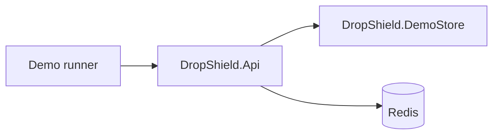
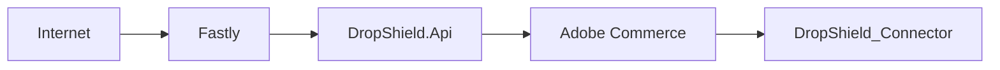

# High-demand product drop demo

A local, scripted walkthrough of DropShield's protection controls against a real DemoStore and
DropShield.Api instance, using the existing synthetic `pokemon-etb` product. It orchestrates
existing DropShield behaviour end to end; it does not add a new protection mechanism.

## What this proves

Run against the local implementation, this demo shows that DropShield:

- allows normal shopper traffic through
- throttles a configured excess of stock-polling traffic
- prevents rate-limited requests from reaching the origin
- performs waiting-room admission and signed admission proof once capacity is exceeded
- requires a one-time action proof before a protected cart/checkout mutation
- rejects reuse of an already-consumed action proof
- reserves scarce synthetic stock atomically and commits it on checkout
- exposes aggregate, non-identifying operational metrics

## What this does not prove

- That Hamleys, or any other retailer, uses this architecture.
- That Hamleys currently uses Fastly. See [docs/fastly.md](fastly.md).
- That Hamleys' actual production bottleneck matches the synthetic DemoStore's stock-lookup
  delay.
- That DropShield has been tested against Hamleys or any other retailer's systems.
- That the synthetic throughput numbers below predict exact production performance.
- That behavioural scoring identifies bots with certainty — it is a short-lived, explainable
  risk signal, not a bot-detection claim, and is not exercised by this demo (see
  [behavioural scoring](behavioural-scoring.md)).
- That the proof-of-concept is production-ready without retailer-specific integration and
  infrastructure work.

## Prerequisites

- .NET 8 SDK
- Docker Desktop, for the demo's Redis instance (see [Redis](#redis))
- `dotnet build DropShield.sln --configuration Release`

## Start the services

Three terminals, from the repository root.

**1. Redis** (a disposable local instance on a non-default port, so it won't collide with
anything else you have running):

```powershell
docker run --rm --name dropshield-demo-redis -p 127.0.0.1:16379:6379 redis:8.8.1-alpine
```

**2. DemoStore:**

```powershell
$env:Logging__LogLevel__Default = 'Warning'
dotnet run --project src/DropShield.DemoStore --configuration Release --no-build --no-launch-profile --urls http://localhost:5058
```

**3. DropShield.Api in the demo configuration** — small admission capacity and short TTLs so
the waiting room and reservation lifecycle are observable in seconds instead of minutes, backed
by the Redis instance above so the demo exercises real distributed state rather than falling
back to InMemory:

```powershell
$env:ASPNETCORE_ENVIRONMENT = 'Development'
$env:Logging__LogLevel__Default = 'Warning'
$env:DropShield__StateProvider = 'Redis'
$env:DropShield__Redis__ConnectionString = '127.0.0.1:16379'
$env:DropShield__Redis__IdentityHashKey = [Convert]::ToHexString([Security.Cryptography.RandomNumberGenerator]::GetBytes(32))
$env:DropShield__Admission__MaximumActiveSessions = '4'
$env:DropShield__Admission__AdmissionBatchSize = '4'
$env:DropShield__Admission__MaximumWaitingSessions = '50'
$env:DropShield__Admission__SessionTtlSeconds = '8'
$env:DropShield__Admission__WaitingTtlSeconds = '30'
$env:DropShield__Admission__RetryAfterSeconds = '2'
$env:DropShield__AdmissionTokens__KeyId = 'demo-1'
$env:DropShield__AdmissionTokens__SigningKey = [Convert]::ToBase64String([Security.Cryptography.RandomNumberGenerator]::GetBytes(32))
$env:DropShield__AdmissionTokens__LifetimeSeconds = '8'
$env:DropShield__ActionProofs__KeyId = 'demo-1'
$env:DropShield__ActionProofs__SigningKey = [Convert]::ToBase64String([Security.Cryptography.RandomNumberGenerator]::GetBytes(32))
$env:DropShield__ActionProofs__LifetimeSeconds = '8'
$env:DropShield__OriginAssertions__KeyId = 'demo-1'
$env:DropShield__OriginAssertions__SigningKey = [Convert]::ToBase64String([Security.Cryptography.RandomNumberGenerator]::GetBytes(32))
$env:DropShield__InternalHashing__SigningKey = [Convert]::ToBase64String([Security.Cryptography.RandomNumberGenerator]::GetBytes(32))
$env:DropShield__InventoryReservation__InitialStock = '10'
$env:DropShield__InventoryReservation__ReservationTtlSeconds = '8'
$env:DropShield__Policies__Cart__ClientPermitLimit = '10'
$env:DropShield__Policies__Checkout__ClientPermitLimit = '10'
dotnet run --project src/DropShield.Api --configuration Release --no-build --no-launch-profile --urls http://localhost:5257
```

The signing keys are freshly generated for this run only, matching the project's existing
ephemeral-key convention for Development — nothing here is a committed secret. `InternalMetrics`
and `SyntheticClientIdentity` are already enabled by `appsettings.Development.json`; the demo
runner depends on both to distinguish synthetic shoppers and read the metrics/inventory
snapshots it reports on.

Cart and checkout permit limits are raised above the small committed defaults because the demo
protocol itself issues an action proof and then consumes it (two calls per mutation, three for
the intentional replay) well within the same one-second window; the committed defaults are sized
for one real mutation per client per window, not this compressed walkthrough.

## Run the demo

```powershell
dotnet run --project demo/DropShield.Demo --configuration Release
```

`DROPSHIELD_DEMO_API_URL` and `DROPSHIELD_DEMO_STORE_URL` override the default
`http://localhost:5257` / `http://localhost:5058` targets if you started the services on
different ports. Both are validated before any request is sent: only `localhost`, `127.0.0.1`,
`::1`, and `host.docker.internal` are accepted, with no override flag. Anything else — including
any retailer hostname — is refused before the demo starts.

## Stages

1. **Healthy origin** — confirms DemoStore answers a product and stock lookup directly.
2. **Normal shopper** — one synthetic identity requests stock and is admitted; DropShield does
   not block ordinary traffic.
3. **Excessive stock polling** — a second synthetic identity sends a small burst of stock
   requests. Some are forwarded, the rest are rate-limited before reaching DemoStore. This
   demonstrates excessive polling / bot-like synthetic traffic being throttled — it is not a
   claim that any specific traffic pattern was identified as a bot.
4. **Admission / waiting room** — three fresh synthetic shoppers request stock against the
   demo's deliberately small admission capacity; the shopper over capacity gets HTTP 202
   waiting, then is admitted once capacity frees up, using the real admission implementation
   with no simulated queue position.
5. **Action proof and cart** — a shopper obtains a one-time signed cart action proof through the
   real `/api/action-proofs/cart` endpoint and successfully adds to cart.
6. **Replay protection** — the same action proof is deliberately reused once; DropShield rejects
   it with `409 action_already_used`.
7. **Inventory reservation** — `/internal/inventory` shows the successful cart operation reduced
   available stock and created a reservation.
8. **Checkout** — the shopper obtains a checkout action proof, checks out, and the reservation
   is committed.
9. **Final metrics** — a concise summary from `/internal/metrics`: incoming, forwarded,
   rate-limited, admitted, waiting, action proofs issued, replay rejections, and reservation
   counts.

No stage prints a cookie, token, signing key, or other secret-bearing value — only outcomes and
status codes.

## REST and GraphQL

This demo walks REST end to end because it is the clearest single path through every control.
GraphQL cart-mutation classification and origin-assertion issuance are already covered by the
Adobe Commerce connector's own test suite and documented in
[docs/adobe-commerce.md](adobe-commerce.md); this demo does not repeat that walkthrough for a
second transport.

## Redis

The documented demo configuration runs DropShield.Api in `Redis` state-provider mode against the
disposable container started above, because distributed state is a real part of DropShield's
design. If Redis is not reachable, DropShield.Api fails closed on protected routes (HTTP 503)
rather than silently falling back to InMemory — start the container first if you see that.

## Fastly and Adobe Commerce

Neither is required for this demo. The demo flow is demo runner → DropShield.Api → DemoStore.
Fastly is a reference edge adapter documented separately (see [docs/fastly.md](fastly.md)); the
Adobe Commerce connector already has its own runtime-validated test coverage and does not need
to run for this walkthrough.



Production-style deployment, for context — not what this demo runs:



## Historical benchmark figures

The synthetic mixed-drop STRESS profile in [docs/benchmarks.md](benchmarks.md) measured
103,618 incoming stock requests, 31,012 forwarded to the synthetic origin, 72,606 rejected, and
a 68.14% reduction in total origin traffic. Those are historical local k6 measurements from a
separate load-testing pass, not something this demo re-measures, and not retailer telemetry —
this demo runs on the order of dozens of requests to make each control's outcome individually
readable, not to reproduce that throughput result.

## Limitations

- The demo's admission capacity, TTLs, and inventory are deliberately small so the scenario
  completes in seconds; they are not representative of any production sizing.
- No storefront UI is exercised — the runner talks to DropShield.Api's REST surface directly, as
  DemoStore has no browser frontend.
- Behavioural scoring is not exercised; forcing an observable score within this scenario's
  small, deterministic traffic would require artificial and confusing traffic patterns. It has
  its own test coverage — see [behavioural scoring](behavioural-scoring.md).
